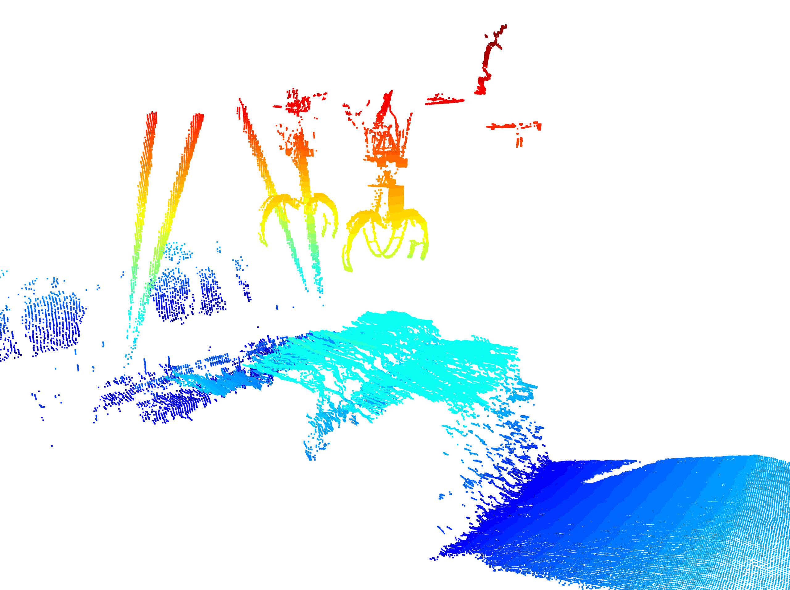

# Portal Crane Dataset

This dataset is collected from a portal crane at a production facility and is used to train a Convolutional Neural Network for accurate segmentation of grapples and headblocks. This dataset comprises 175 point cloud data derived from an Ouster LiDAR sensor (with 128 x 2048 resolution) mounted on the cabin of the crane. It contains several short time sequences, with each point cloud extracted and can be treated as a completely independent scene. To enhance the diversity of our dataset, we captured data featuring various grapple angles and heights, reflecting its dynamic movement during production. We additionally included scenarios where the grapple was occluded while grasping or depositing wood bundles.

To encourage further research and development in the field of crane automation, we have made this dataset publicly available. As there is a significant lack of publicly available datasets specifically tailored for portal cranes and their unique grapple shapes, we hope this dataset will be a valuable resource for the research community.



## How to Clone This Repository
This repository contains the dataset zip file tracked with [Git LFS](https://git-lfs.github.com/). To clone and use this repository, first install **Git LFS**, then clone the repository.

**Install Git LFS**:
   - Linux: `sudo apt install git-lfs`
   - macOS: `brew install git-lfs`

## Visualization
To visualize a point cloud from the dataset one way is by running the visualizer Jupyter notebook. Here's how you can do that:

1. First, ensure you have Python installed on your system, with a version between 3.8 and 3.11. You can check your Python version by running:
   ```
   python --version
   ```
   or
   ```
   python3 --version
   ```   
2. Then, you can use pip to install the requirements:
   ```
   pip install open3d notebook
   ```
3. Extract the `portal_crane_dataset.zip` file in the same directory. (If you are using Linux, extract `point_clouds` folder in the root directory of the project.)

4. Navigate to the Portal_Crane_Dataset directory in your terminal:

5. Launch Jupyter Notebook:
   ```
   jupyter notebook
   ```
6. In the Jupyter interface that opens in your web browser, locate and click on the "[visualizer.ipynb](./visualizer.ipynb)" file to open it.

7. You can now run the cell in the notebook to see how a point cloud from the dataset looks like. 


Portal Crane Dataset © 2025 by PSIORI GmbH is licensed under CC BY-SA 4.0 
